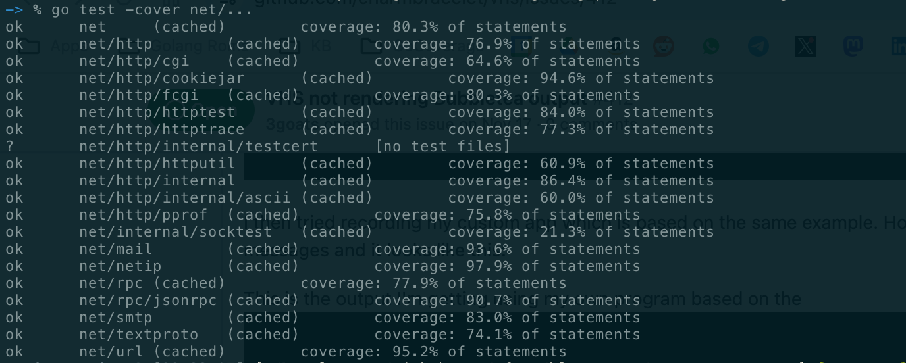
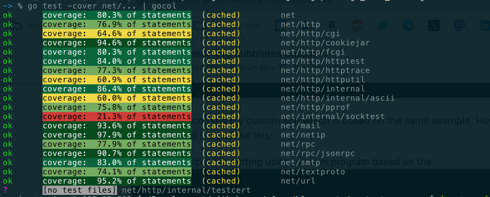
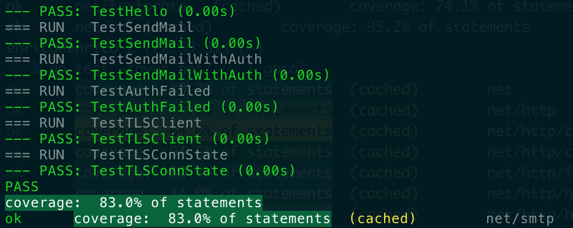
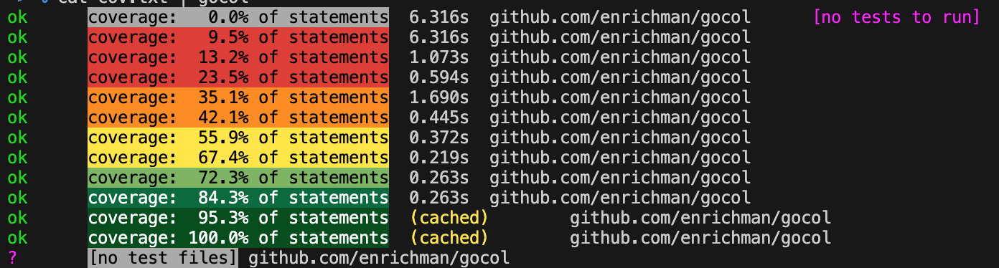

# __<font color="red">g</font><font color="orange">o</font><font color="yellow">c</font><font color="greenyellow">ol</font>__

__<font color="dodgerblue">Go</font> <font color="red">C</font><font color="orange">o</font><font color="yellow">l</font><font color="greenyellow">or</font>__ your test coverage! ✨

Turn this:



into this!



See immediately how weel your projects is covered!

## Installation

To install `gocol` just use `go install`
```
go install github.com/enrichman/gocol@v0.0.1
```

## Usage

Pipe the output of a `go test -cover` to `gocol`
```
go test -cover ./... | gocol
```

If you are using the verbose `-v` then the `PASS|FAIL|SKIP` lines will be coloured as well.




# Colors and ranges 🌈

Currently only a fixed range of colors and percentage is available.



# Feedback
If you like the project please star it on Github 🌟, and feel free to drop me a note, or [open an issue](https://github.com/enrichman/gocol/issues/new)!

[Twitter](https://twitter.com/enrichmann)

# License

[MIT](LICENSE)